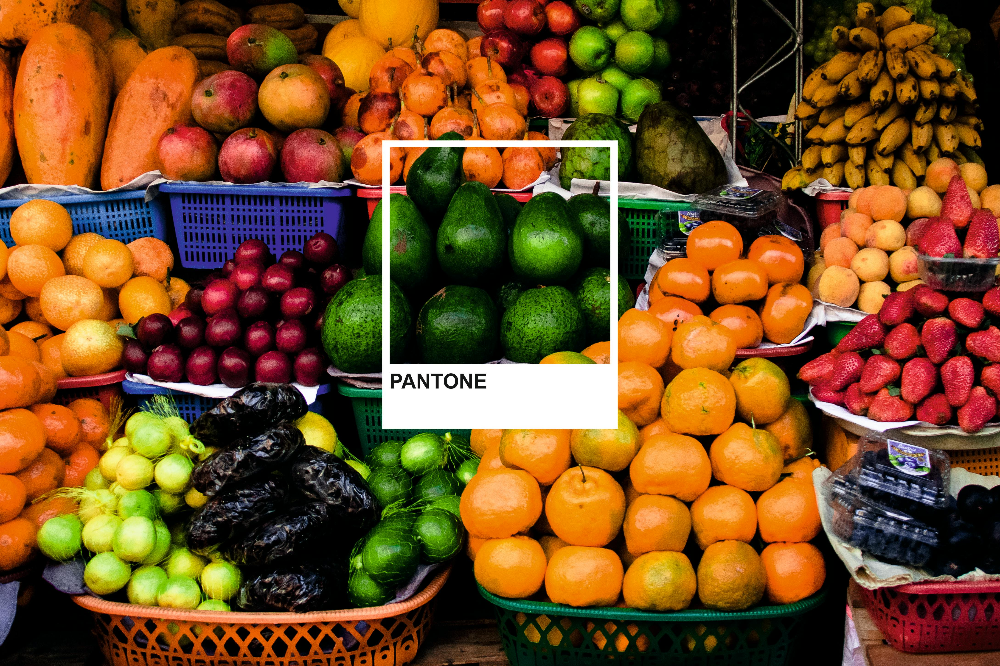

# 🍎🥕 Fruits & Vegetables Recognition System 🥦🍇

A user-friendly web application that leverages Artificial Intelligence (AI) and Deep Learning to accurately identify fruits and vegetables from images using a Convolutional Neural Network (CNN). Built with Streamlit and TensorFlow.

---

## 🚀 Demo



---

## ✨ Features
- **High Accuracy Recognition**: Trained on a diverse dataset of fruits and vegetables.
- **User-Friendly Interface**: Upload an image and get instant predictions.
- **Educational Insights**: Learn about the predicted item.
- **Modern Web App**: Built with Streamlit for easy access and interactivity.

---

## 🧠 How It Works
1. **Upload an Image**: The user uploads a photo of a fruit or vegetable.
2. **Image Processing**: The image is resized and preprocessed for the model.
3. **Prediction**: The trained CNN model predicts the class.
4. **Result**: The predicted label is displayed to the user.

---

## 📂 Dataset & Labels
The model is trained on a curated dataset of high-quality images, covering the following categories:

<details>
<summary>Click to view all 36 classes</summary>

```
apple, banana, beetroot, bell pepper, cabbage, capsicum, carrot, cauliflower, chilli pepper, corn, cucumber, eggplant, garlic, ginger, grapes, jalepeno, kiwi, lemon, lettuce, mango, onion, orange, paprika, pear, peas, pineapple, pomegranate, potato, raddish, soy beans, spinach, sweetcorn, sweetpotato, tomato, turnip, watermelon
```
</details>

---

## 🛠️ Installation

1. **Clone the repository**
   ```bash
   git clone <repo-url>
   cd Fruit_veg_webapp
   ```
2. **Install dependencies**
   ```bash
   pip install -r requirements.txt
   ```
3. **Ensure the following files are present:**
   - `trained_model.h5` (pre-trained model)
   - `labels.txt` (class labels)
   - `Fruits.jpg` (demo image)

---

## ▶️ Usage

Run the Streamlit app:
```bash
streamlit run main.py
```

- Open your browser to the provided local URL.
- Use the sidebar to navigate between Home, About Project, and Prediction.
- Upload an image in the Prediction tab and click **Predict**.

---

## 🗂️ Project Structure
```
Fruit_veg_webapp/
├── Download_image/         # Sample images
├── Fruits.jpg              # Demo image
├── labels.txt              # Class labels
├── main.py                 # Streamlit web app
├── requirements.txt        # Python dependencies
├── trained_model.h5        # Trained CNN model
└── README.MD               # Project documentation
```

---

## 🚦 Future Work
- Expand dataset with more categories and images
- Integrate real-time camera support
- Deploy as a web service or mobile app
- Add nutritional and culinary information for each class

---

## 🙏 Acknowledgements
- TensorFlow & Keras for deep learning
- Streamlit for rapid web app development
- Open-source datasets and contributors

---

## 📄 License
This project is for educational purposes. Please check dataset and model licenses before commercial use.
